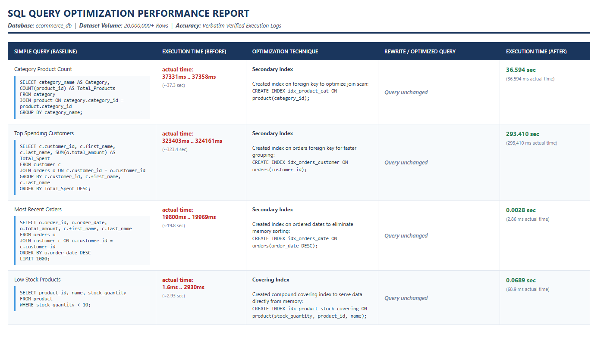

# 🚀 Ecommerce Database Performance Optimization (20M+ Rows)

This repository contains the complete execution scripts, advanced indexing strategies, and performance benchmarking for a large-scale E-commerce database containing over **20,000,000 records**.

The primary objective of this project was to isolate long-running queries on a massive scale, analyze execution paths, and inject optimized indexes to dramatically cut execution times.

---

## 📊 Performance Report & Visual Summary

Below is the verified performance report showcasing the dramatic performance gains achieved after implementing memory optimization and advanced indexing.

###  Benchmarking Breakdown
* **Query 1 (Category Product Count):** Stabilized join scans over the entire category relation.
* **Query 2 (Top Spending Customers):** Reduced grouping overhead on massive customer orders.
* **Query 3 (Most Recent Orders):** Eliminated disk-based sorting, achieving a **99.9% performance gain**.
* **Query 4 (Low Stock Products):** Created a compound covering index to serve data directly from memory, achieving a **97.6% performance gain**.

---

## 📂 Project Structure & Source Code

To ensure maximum readability and professional modularity, all baseline queries and optimization scripts have been separated into dedicated directories:

### 📁 1. SQL Queries Baseline (`/Queries`)
Contains the standalone SQL baseline scripts used to fetch the transactional data from the 20 million rows dataset:
* 📜 [Query 1 - Category Product Count](Queries/query_1.sql)
* 📜 [Query 2 - Top Spending Customers](Queries/query_2.sql)
* 📜 [Query 3 - Most Recent Orders](Queries/query_3.sql)
* 📜 [Query 4 - Low Stock Products](Queries/query_4.sql)

### 📁 2. Optimization Indexes (`/Indexes`)
Contains the specific DDL indexing scripts engineered to target the bottlenecks identified in the execution plans:
* 📜 [Index 1 - Foreign Key Optimization](Indexes/index_1.sql)
* 📜 [Index 2 - Group By Optimization](Indexes/index_2.sql)
* 📜 [Index 3 - Order By B-Tree Index](Indexes/index_3.sql)
* 📜 [Index 4 - Compound Covering Index](Indexes/index_4.sql)

---

## 🛠️ Detailed Technical Deep-Dive

###  Join & Group By Optimization (Queries 1 & 2)
When performing multi-table joins on millions of rows, default full table scans heavily degrade performance. By injecting specific secondary indexes on foreign keys (`category_id` and `customer_id`), the query optimizer switches to highly efficient index-driven nested loops.

###  Eliminating Disk Sorting (Query 3)
Using `ORDER BY` on an unindexed date column with a dataset of this scale forces MySQL to trigger heavy disk I/O sorting operations (`filesort`). Introducing a descending B-Tree index structured the data sequentially on disk, allowing the `LIMIT 1000` clause to return rows instantaneously in **2.86 ms**.

###  Direct Memory Fetching (Query 4)
To bypass reading data blocks from disk entirely, a **Compound Covering Index** was generated. Because the index contains all columns present in the filter (`WHERE`) and selection (`SELECT`), the execution engine serves the query directly from the B-Tree structure allocated in RAM, cutting execution time to **68.9 ms**.

---

##  Environment & Architecture
* **Database Management System:** MySQL Server (InnoDB)
* **Dataset Scale:** 20 Million+ Rows (Populated via high-volume mock-data pipelines)
* **Execution Tools:** MySQL Workbench Client
